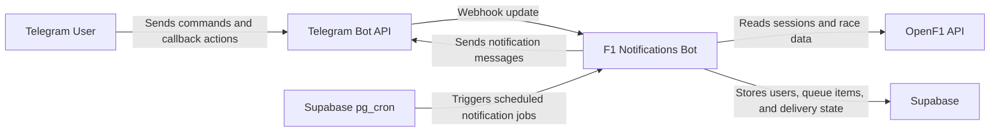
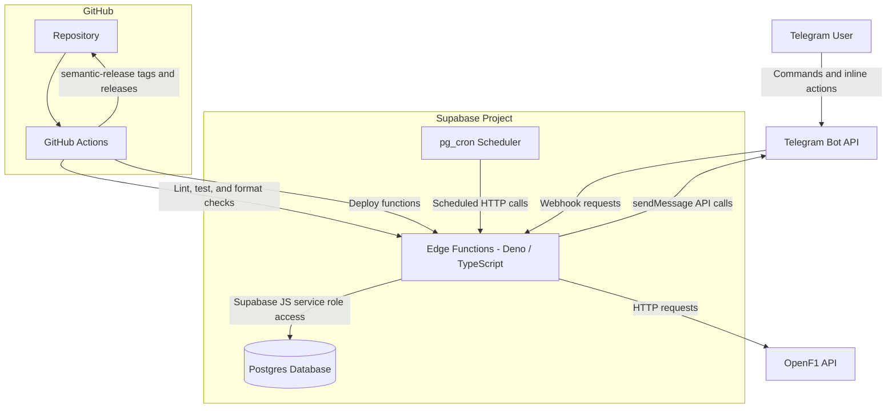
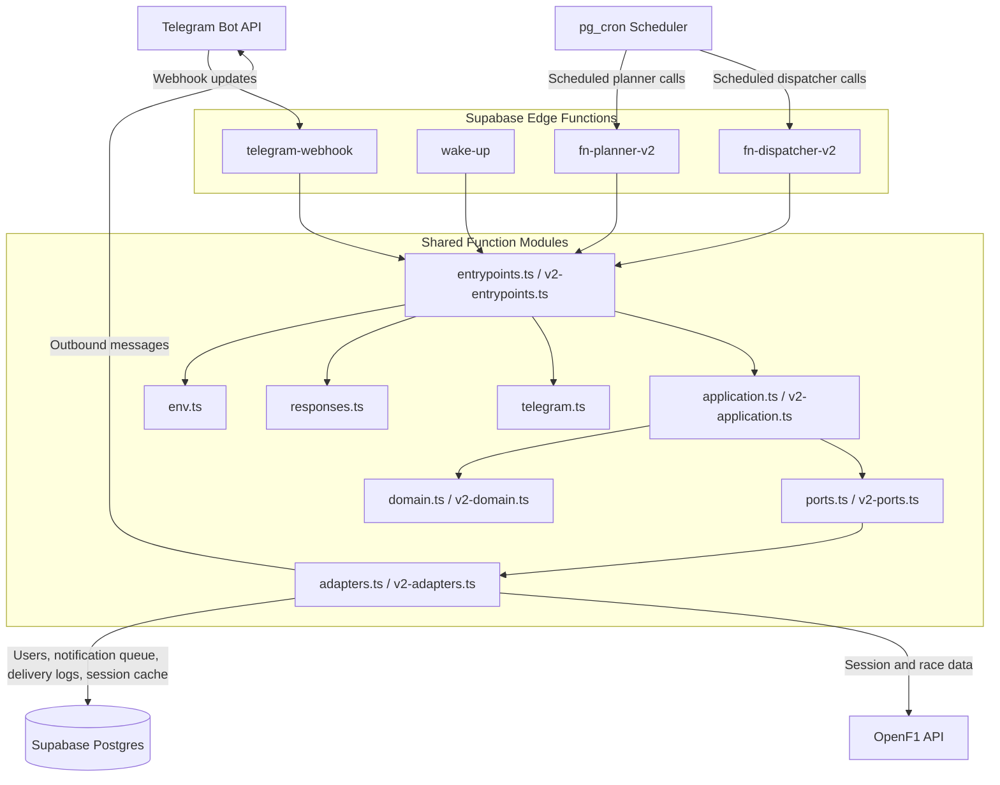
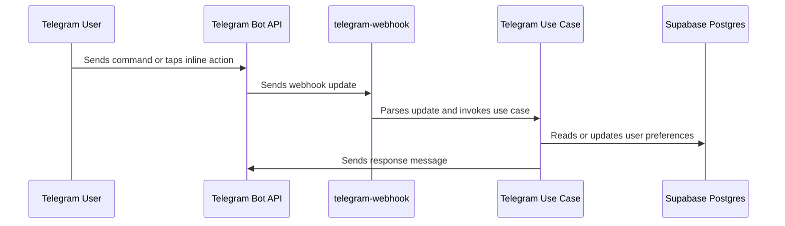
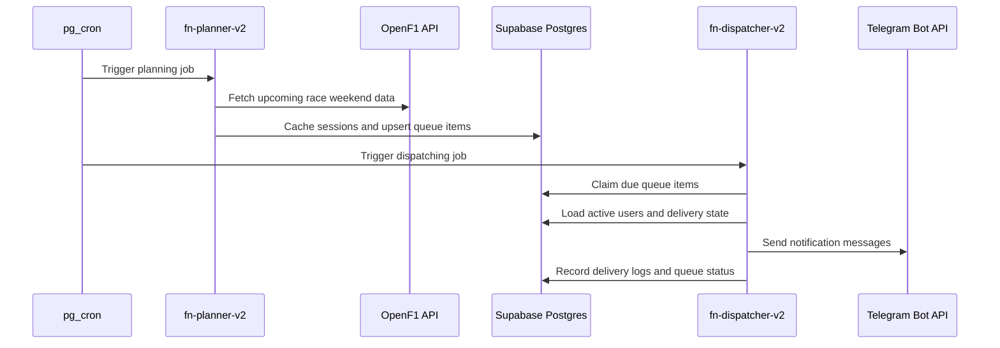
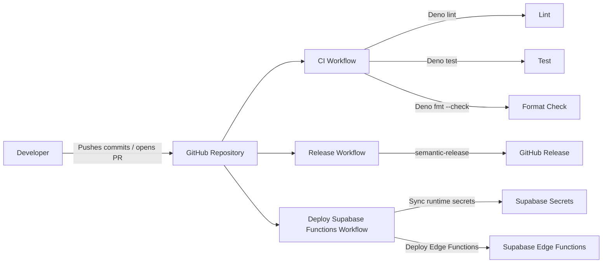

# C4 Architecture

This document describes the F1 Notifications Bot architecture using the C4 model.

## Level 1: System Context

The F1 Notifications Bot helps Telegram users subscribe to Formula 1 notifications. It receives commands and callbacks from Telegram, stores user preferences in Supabase, reads race data from OpenF1, and sends scheduled reminders back through Telegram.

### External Systems

- **Telegram Bot API**: receives user interactions and delivers bot messages.
- **OpenF1 API**: provides Formula 1 session and race data.
- **Supabase**: hosts Edge Functions, Postgres, and scheduled jobs.
- **GitHub Actions**: validates, releases, and deploys the project.

## Level 2: Containers

The system is implemented as Supabase Edge Functions written in TypeScript and running on Deno. Persistent state lives in Supabase Postgres, while `pg_cron` owns the production notification schedule.

### Containers

- **Edge Functions**: HTTP entrypoints for Telegram webhooks, manual wake-up triggers, planning jobs, and dispatching jobs.
- **Postgres Database**: stores users, notification delivery markers, cached F1 sessions, queued notifications, and delivery logs.
- **pg_cron Scheduler**: periodically invokes the planner and dispatcher functions.
- **GitHub Actions**: runs CI, deploys Supabase functions, and publishes semantic releases.

## Level 3: Edge Function Components

The Edge Functions share a layered internal structure: entrypoints parse HTTP requests, application services coordinate use cases, domain modules hold business rules, ports define interfaces, and adapters connect to external systems.

### Function Responsibilities

- **telegram-webhook**: receives Telegram updates, handles `/start`, `/subscribe`, `/unsubscribe`, `/set_country`, subscription callbacks, and timezone/country callbacks.
- **wake-up**: supports legacy or manual notification triggers such as `weekly_digest`, `session_reminder`, and `post_race_briefing`.
- **fn-planner-v2**: reads upcoming F1 sessions from OpenF1, caches session data, and creates notification queue items.
- **fn-dispatcher-v2**: claims due notification queue items, resolves recipients, sends Telegram messages, and records delivery results.

### Data Stores

- **users**: Telegram users, subscription status, profile information, and timezone preference.
- **notification_deliveries**: legacy idempotency log for sent notifications.
- **f1_sessions_cache**: cached OpenF1 session data used by the v2 pipeline.
- **notification_queue**: scheduled notification items waiting to be dispatched.
- **delivery_logs**: per-user delivery attempts and results for queued notifications.

## Main Runtime Flows

### Telegram Interaction Flow

### Notification Pipeline V2 Flow

## Deployment and Operations

The `develop` branch is intended for integration and CI validation. The `main` branch is intended for production releases and Supabase deployment.
